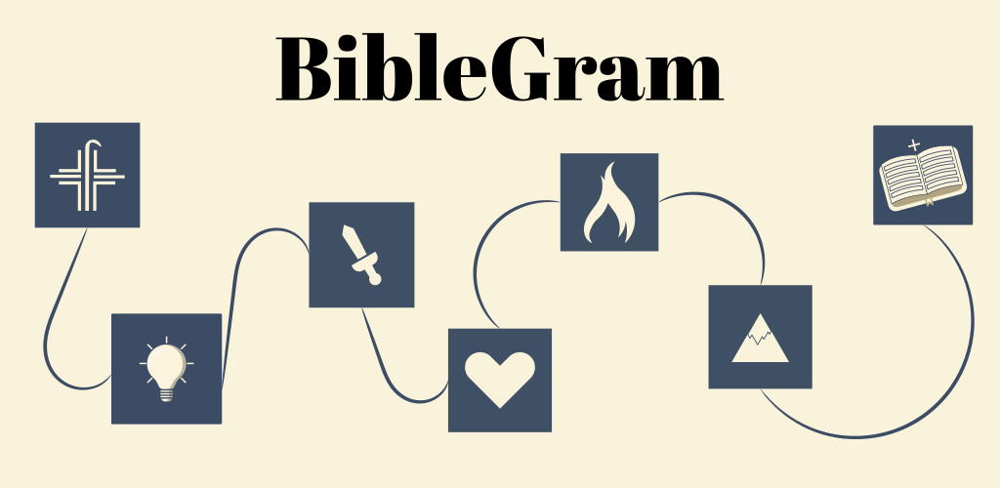
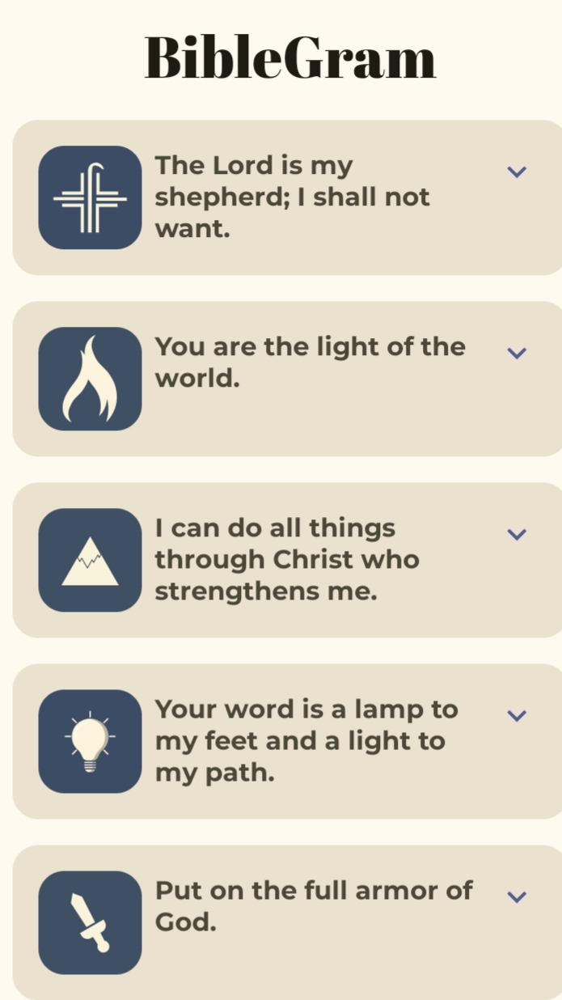
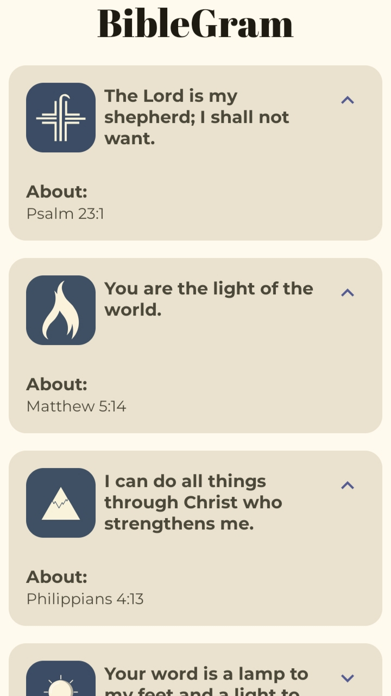
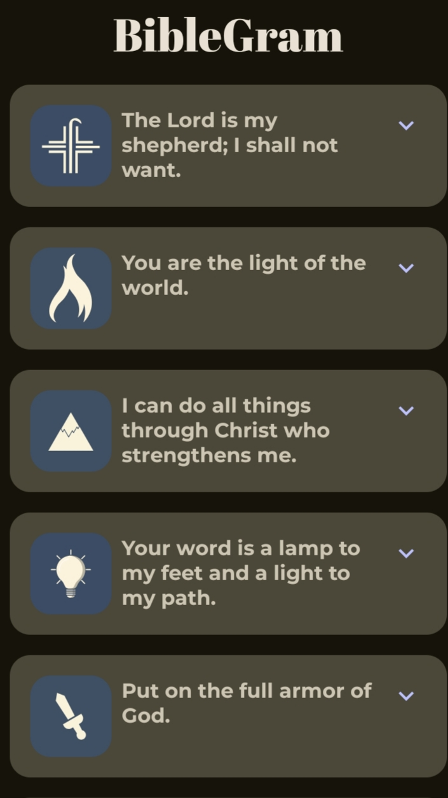
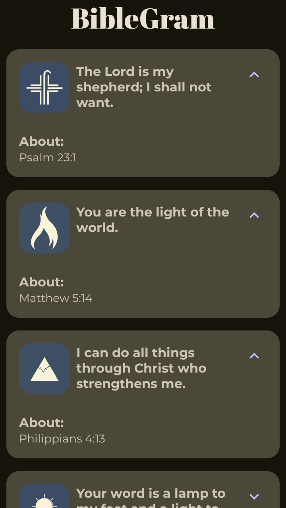

  

## Table of Contents
- [Overview](#overview)
- [Features](#features)
- [Technologies Used](#technologies-used)
- [Project Structure](#project-structure)
- [Vector Images](#vector-images)
- [App Screenshots](#app-screenshots)

## Overview
BibleGram is a self-project inspired by the Google Developers Android Basics with Compose (Unit 3) training. It showcases the implementation of lists and the use of Material Design, following Google's latest best practices for Android development.
The app leverages **Jetpack Compose** and **Material Design 3** to provide a seamless user experience, while also allowing users to expand and read more about each quote.

Currently, the app includes **five sample Bible quotes** to demonstrate the functionality and design of the app. These quotes are used for testing and as placeholders for the future addition of more content.

## Features

- 📖 5 Bible Quotes with customizable UI components.
- 🌟 Expandable cards to display the quote’s author and additional information.
- 📜 Smooth animations using Jetpack Compose's **animateContentSize** to provide a polished experience.
- 🎨 Beautiful Material Design 3 theme implementation.

## Technologies Used

- **Kotlin**: The programming language used for Android app development.
- **Jetpack Compose**: The modern toolkit for building Android UIs.
- **Material Design 3**: Provides a consistent and beautiful design language across the app.
- **LazyColumn**: Efficiently handles long lists of quotes, ensuring smooth scrolling and user interaction.

## Project Structure

The app structure follows best practices, keeping the code clean, modular, and easy to maintain. Some key components:

- **MainActivity**: The entry point of the app that sets up the UI using Compose and the Material 3 theme.
- **Scaffold & TopAppBar**: Used for the app's main layout, including the top app bar with a title.
- **LazyColumn**: Displays a list of five Bible quotes, efficiently handling the rendering of the list.
- **QuoteItem**: Each quote is represented as a card. The card expands to show more details about the quote when clicked.
- **Animations**: The expand/collapse functionality is animated using Jetpack Compose’s `animateContentSize`.

## Vector Images

All vector images used in this project were created by me, and **all rights are reserved**. These images were specifically designed for the app, giving each quote card a unique and visually appealing identity.

## App Screenshots
### Light Mode: 

  
  

### Dark Mode:

  
  

